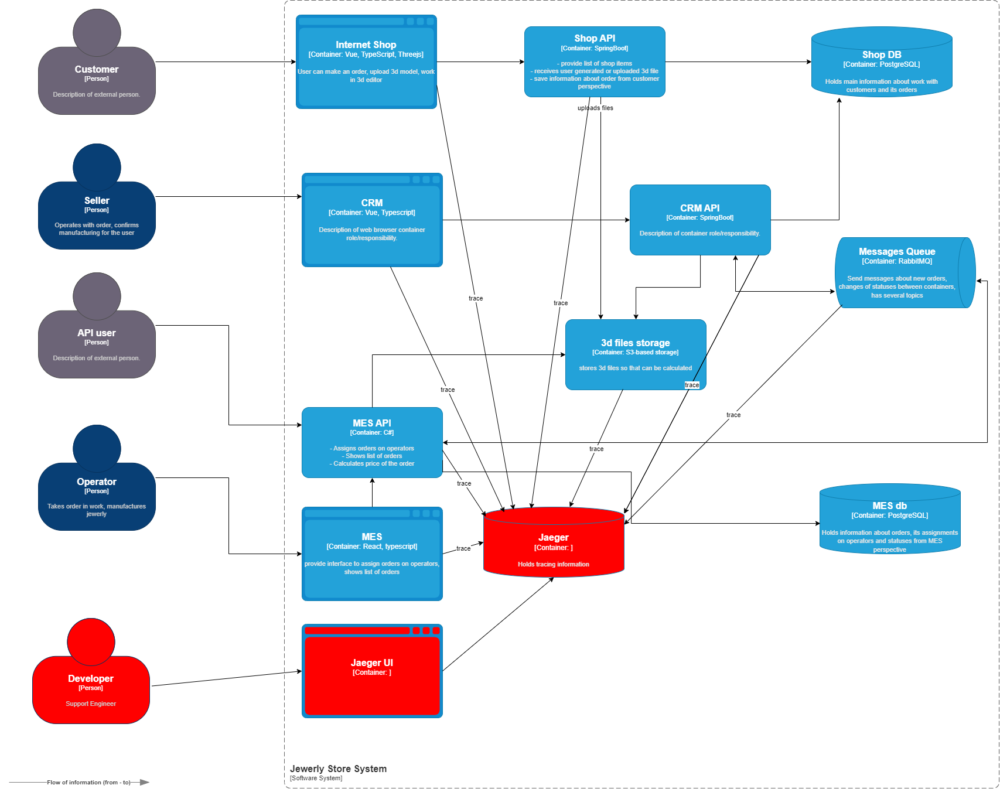

## Планирование

Клиенты жалуются менеджерам по продажам, что они не получили заказ и над их изделием работают уже несколько месяцев, хотя обещали закончить за три недели.

Это может быть вызвано проблемами в потоках данных (Созданный заказ не сохранился):
 - "Internet shop" -> "Shop API" -> "Shop DB"
 - "Internet shop" -> "Shop API" -> "3d file storage" 

Проблемы с подтверждением заказа в CRM могут быть вызваны ошибками в цепочках:
 - "CRM" -> "CRM API" -> "Shop DB"
 - "CRM" -> "CRM API" -> "Message Queue"
 - "CRM" -> "CRM API" -> "3d file storage"

Проблемы с операторов MES с оформлением заказов могут таиться здесь:
 - "MES UI" -> "MES API" -> "MES DB"
 - "MES UI" -> "MES API" -> "Message Queue"
 

В трейсинг должны попасть данные:
 - Order_id
 - User_id

## Предлагаемое решение

Поддержку трейсинга нужно реализовать с помощью инструмента Jaeger.
Для этого в каждом сервисе нужно добавить поддержку Jaeger с помощью стандартных библиотек.

[jewerly_c4_model_tracing.drawio](jewerly_c4_model_tracing.drawio)

## Компромиссы

Из за возможных сложностей реализации поддержку трейсига через RabbitMQ можно отложить.
Так же можно отложить трейсинг внутри CRM, так как на него не было жалоб. 
Скорее всего наиболее проблемным местом является MES, на нём и нужно сосредоточиться.

## Безопасность

Для предотвращения несанкционированного доступа к системе трейсинга должна быть внедрена аутентификация — зайти в систему смогут только сотрудники компании с актуальной учетной записью и ролью "Поддержка"
