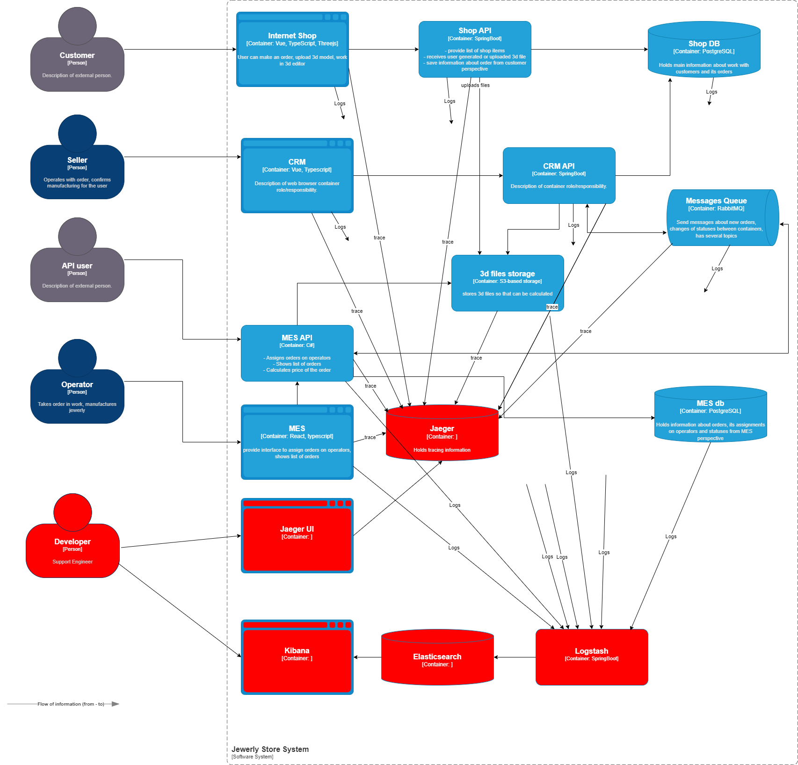

# Мотивация

Добавление логирования в систему является важным шагом для обеспечения прозрачности работы приложения, улучшения диагностики проблем и оптимизации бизнес-процессов. Логи предоставляют детальную информацию о событиях, происходящих в системе, что позволяет анализировать её поведение как в реальном времени, так и после возникновения инцидентов. Это даст компании возможность быстрее реагировать на проблемы, минимизировать простои и улучшить качество предоставляемых услуг.

### Почему нужно внедрять логирование:

1. **Диагностика и предотвращение сбоев**  
   Логи позволяют выявлять причины ошибок и аномалий в работе системы. Это особенно важно для распределенных систем, где взаимодействие между компонентами может быть сложным и трудно отслеживаемым без подробных записей.

2. **Анализ пользовательского поведения**  
   Логирование помогает собирать данные о действиях пользователей, что может быть использовано для улучшения пользовательского опыта и оптимизации бизнес-процессов.

3. **Оптимизация производительности**  
   Анализ логов позволяет выявить узкие места в работе системы и оптимизировать её производительность.

---

### Технические и бизнес-метрики, на которые повлияет внедрение логирования:

1. **Время до восстановления системы (MTTR)**  
   Логи позволяют быстро находить корень проблемы, что сокращает время на поиск и устранение неисправностей. Это напрямую влияет на метрику MTTR (Mean Time to Recovery), которая является ключевым показателем эффективности DevOps-команд.

2. **Процент успешных транзакций (Success Rate)**  
   Логирование помогает отслеживать выполнение транзакций и выявлять их сбои. Повышение процента успешных транзакций напрямую влияет на удовлетворенность клиентов и доходы компании.

3. **Задержки в обработке запросов (Latency)**  
   Анализ логов позволяет выявить задержки на разных этапах обработки запросов, что помогает оптимизировать производительность системы и улучшить пользовательский опыт.

4. **Качество кода (Code Quality)**  
   Логи могут использоваться для анализа частоты появления ошибок в различных частях кода. Это помогает разработчикам сосредоточиться на улучшении наиболее проблемных участков, снижая технический долг.

# Анализ и планирование

Для получения максимальной пользы от логирования, нужно собирать логи **во всех микросервисах и логи баз-данных**.
В качестве объектов логирования должны выступать:
 - Любые действия пользователей на фронтенде
 - Все вызовы API
 - Изменения статуса ордера
 - Получение и постановка сообщений в очередь
 - Подробное логирование долгих процессов (вычисление цены)

Все эти логи должны иметь уровень INFO, логировать время, идентификатор покупателя, номер заказа, название сервиса, класса и функции.

Кроме того с уровнем WARNING нужно логировать неудачные попытки логина, ошибки при загрузке файлов от покупателя и слишком долгие расчёты цены (например дольше 5 минут).
Все эксепшены должны логироваться с уровнем ERROR.

# Предлагаемое решение

Система логирования будет реализована на стеке ELK.

Для предотвращения несанкционированного доступа к системе логирования должна быть внедрена аутентификация — зайти в систему смогут только сотрудники компании с актуальной учетной записью и ролью "Поддержка"

Срок хранения логов будет установлен на 1 месяц.

Системе удобнее работать с небольшими индексами, чем с одной большой базой данных. Поэтому отдельные индексы будут созданы для каждого микросервиса.

[jewerly_c4_model_logging.drawio](jewerly_c4_model_logging.drawio)

# Анализ логов

Kibana предоставляет мощные инструменты для визуализации данных. Создание дашбордов с ключевыми метриками (например, временем ответа бэкенда) помогает быстро оценивать состояние системы. Также возможности агрегирования данных позволяют нам создать, например, такие дашборды:

- Определение общих продаж по регионам, производителям, типам заказов.
- Активность пользователей по времени суток.
- Время исполнения заказа по производителям и регионам.

Использование встроенных функций Kibana для настройки правил оповещений позволяет своевременно реагировать на инциденты. Это особенно важно для проактивного мониторинга и предотвращения проблем. Алёрты следует установить на
- Резкое повышение активности пользователей
- Резкое увеличение количества заказов.
- Высокое количество заказов в очереди.

