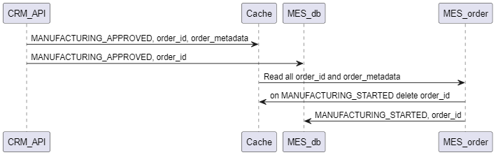

# Анализ и планирование

Операторы жалуются на низкую скорость работы со страницей, а новых клиентов не устраивает скорость выполнения заказа.

Проблемы со скоростью выполнения заказа могут быть вызваны тем, что операторам неудобно работать с системой MES и они не набирают достаточно большое количество доступных заказов.
Таким образом самым узким местом системы является MES. Туда мы и будем добавлять кеширование.

# Мотивация

Внедрение кэширования в систему рекомендуется для улучшения производительности и масштабируемости за счёт снижения времени доступа к данным. 

# Предлагаемое решение

Кроме этого, необходимо настроить две группы инстансов MES (для расчёта стоимости и для работы с UI) с разными настройками автоскейлинга. Сейчас вычисление цены потребляет много ресурсов и это может негативно влиять на обработку API запросов связанных с заказами.
Для повышения производительности MES нам нужно кешировать статические данные фронтенда (например через механизм Local Storage) и статусы заказов.
Для максимальной скорости обновления статусов заказов мы применим кеширование по паттерну Write-Behind.
Это позволит максимально быстро обновлять статусы заказов предоставлять пользователям актуальную информацию о заказе по запросу MES-order.

| Паттерн | Особенности |
| --- | --- |
| Write-Behind | (+) Низкая стоимость, Консистентность данных, Высокая скорость передачи данных|
| Cache-Aside | (-) Высокое время запроса пока кеш пуст, неконсистентность данных|
| Write-Through| (-) Задержки в передаче данных |
| Refresh-Ahead| (-) Лучше подходит для операций чтения|

Основная идея в то, чтобы при обновлении статуса заказа в CRM на MANUFACTURING_APPROVED - мы пишем эту информацию в кэш (order_id как ключ, метаданные необходимые для фильтрования как значение), а затем пишем это в MES_db.
MES-order API читает все данные об ордерах из кеша, это даёт максимально быстрый ответ по списку доступных ореров.
При получении статуса MANUFACTURING_STARTED MES-order сначала удаляет соответсвующий ордер из кеша, а затем пишет информацию в MES_db.

Таким образом инвалидация кеша происходит по значению, это позволяет держать в кэше актуальный список оредров в статусе MANUFACTURING_APPROVED.

Временная инвалидация не подходит, так как статусы могут меняться очень быстро. Она создаст проблемы с транзакционностью.

